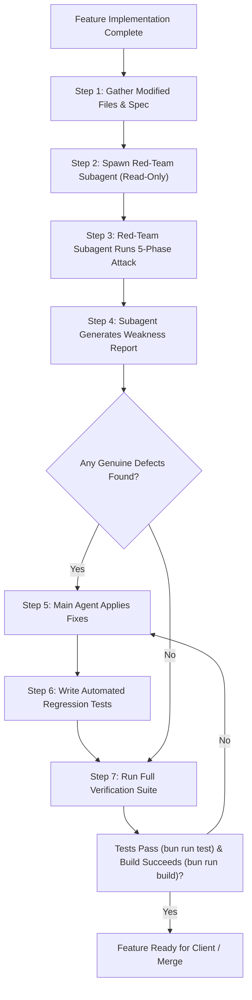

# AGENTS.md — Red-Team Quality Assurance & Security Protocol

This document defines the standard operating procedure for AI coding agents and developers when implementing, testing, and verifying features in the **Dr. Meow (AbsenEmployee)** mobile application codebase.

---

## 1. Core Rule: Mandatory Red-Team Review

> [!IMPORTANT]
> **Before any feature branch or pull request is completed, merged, or presented to the user, a read-only Red-Team subagent MUST be spawned via `invoke_subagent` to actively attack and attempt to break the newly implemented code.**
> No feature is considered complete until all verified vulnerabilities, race conditions, edge cases, and memory leaks are remediated and backed by automated regression tests.

---

## 2. Red-Team Agent Persona & Constraints

- **Type**: `research` or general agent (`inherit` model tier).
- **Role**: `Red-Team QA & Security Subagent`.
- **Permissions**: **Strictly Read-Only**. The red agent explores files and tests hypotheses mentally, but **must never** write files, apply patches, or execute destructive commands directly.
- **Target Application**: **Dr. Meow (AbsenEmployee)** — Employee Self-Service Mobile App (React 19 + TypeScript + Vite + Tailwind CSS v4 + Capacitor 8 + Supabase HR schema).
- **Goal**: Find genuine weaknesses, race conditions, state desynchronizations, geofence boundary flaws, storage traversal risks, memory leaks, and security oversights.

---

## 3. Standard Workflow



---

## 4. Phase-by-Phase Attack Methodology (AbsenEmployee Context)

The Red-Team subagent must examine all modified files in this **EXACT order of priority**:

### Phase 1: Concurrency & Races
- **Double-Tap / Rapid Submission**:
  - *Attendance Clock-In / Clock-Out* (`handleConfirmClockIn`, `handleConfirmClockOut` in `src/pages/Home.tsx`): Can a user double-tap "Konfirmasi", triggering duplicate Supabase storage uploads or duplicate records in `hr.attendance`?
  - *Kasbon Request* (`handleSubmit` in `src/pages/Kasbon.tsx`): Can rapid clicking on "Kirim Pengajuan" fire multiple insert mutations before `usedThisMonth` or `remainingLimit` updates, allowing limit overdrawing?
  - *Leave Application* (`handleSubmit` in `src/components/absensi/LeaveApplicationForm.tsx`): Can rapid clicking insert duplicate leave requests for the same date span?
- **In-flight Mutex**: Is re-entrancy blocked with explicit `loading` / `isSubmitting` guards and `disabled={loading}` on UI action buttons?
- **Optimistic UI vs Realtime Sync**: In `src/hooks/useKasbon.ts`, does the Supabase `postgres_changes` subscription race against manual `loadAll()` refreshes? Can rapid state changes trigger duplicate toast notifications or stale cache overwrites?
- **Hardware Asynchrony Races**: Does the app handle race conditions between camera capture (`capturePhoto()`) and GPS acquisition (`getLocation()`)? What if the user cancels camera capture or revokes GPS permission mid-flow?

### Phase 2: State-Machine Transitions & Re-entrancy
- **Attendance Flow Integrity**: Transitions between `idle` $\rightarrow$ `confirm` $\rightarrow$ `success`. Can a user trigger clock-out when `todayRecord` is null, or clock-in when today's record is already completed?
- **Step Skipping & Illegal Bypass**: Can a user manipulate component state to confirm attendance without valid coordinates (`coords === null`) or without a camera blob (`photoBlob === null`)?
- **Kasbon Lifecycle**: Transitions between `idle` $\rightarrow$ `form` $\rightarrow$ `submitting` $\rightarrow$ `success` / `error`. Does `cancelKasbon` allow canceling a request that has already transitioned to `approved` or `rejected`?
- **Leave Request State**: Can users pick invalid dates (`startDate > endDate`), past dates, weekend-only ranges, or dates that already have existing attendance/leave records?
- **Auth & Role Guards**: In `src/router.tsx`, does `RoleGuard` properly redirect admin/superadmin accounts away from the employee mobile app? Can an employee with `must_change_password: true` navigate to other tabs before resetting their password?

### Phase 3: Security & Input Sanitization
- **Storage & Path Traversal**:
  - In `src/components/absensi/LeaveApplicationForm.tsx`: File attachments uploaded to Supabase storage must sanitize `attachment.name` (strip directory traversal `../`, null bytes, and non-alphanumeric characters).
  - In `src/pages/Profil.tsx` and `src/hooks/useAbsensi.ts`: Ensure file extensions are whitelisted (`jpg`, `jpeg`, `png`, `webp`, `pdf`). Never use unseeded `Math.random()` for storage keys or security tokens—use `crypto.randomUUID()` or timestamp + UUID.
- **Reverse Tabnabbing & External Links**:
  - Do external links (e.g., WhatsApp CS in `src/pages/Profil.tsx`, Google Maps URLs) include `rel="noopener noreferrer"` or pass `'noopener,noreferrer'` to `window.open`?
- **Input Validation & Sanitization**:
  - Kasbon amount: Validate `amount > 0` and integer values. Block negative numbers, exponents, or `NaN`.
  - Reason & text fields: Trim whitespace (`reason.trim()`). Enforce minimum character length ($\ge 5$ characters) to prevent empty/meaningless requests.
  - Phone numbers: Validate minimum digits ($\ge 8$ digits) and sanitize non-numeric characters.

### Phase 4: Error Paths, Null Safety & Geofence Boundaries
- **Geofence Boundary Conditions**:
  - In `src/lib/geofence.ts` (`isWithinArea`, `getDistance`): What if coordinates are `NaN`, `0, 0` (Null Island), or undefined?
  - Does distance calculation clamp properly to prevent negative values or division by zero?
  - Is GPS accuracy evaluated (e.g. handling low-accuracy GPS readings $> 100\text{m}$ radius)?
- **Financial & Calculation Safeguards**:
  - In `src/hooks/useKasbon.ts`: Ensure `remainingLimit = Math.max(0, kasbonLimit - usedThisMonth)` to prevent negative limits.
  - In `src/pages/SlipGaji.tsx`: Ensure `net_salary` calculation never crashes on `null` or `undefined` bonus/deduction items.
  - Printable and display slips must display exact rupiah values (`formatCurrencyFull` / `id-ID`) rather than truncated estimates.
- **Partial Supabase Operations**:
  - If a photo upload to `attendance-photos` storage succeeds but the subsequent database row insertion fails, does the app surface an actionable error and allow retry, rather than hanging or leaving an inconsistent state?
- **Null Safety in UI**:
  - Are optional relations and user fields (`authUser.shift`, `dbUser.jabatan`, `todayRecord.clock_out_time`, `selectedRecord`) safely guarded against `TypeError: Cannot read properties of null`?
- **Native Platform Fallbacks**:
  - For native mobile environments (iOS / Android via Capacitor), does `window.print()` check `(window as any).Capacitor?.isNativePlatform?.()` and provide a screenshot fallback notice?

### Phase 5: Durability, Memory Leaks & Offline Resilience
- **Object URL Cleanup**:
  - In `src/pages/Home.tsx`: When `URL.createObjectURL(photo)` is called for selfie preview, the previous URL **must** be released via `URL.revokeObjectURL(photoUrl)` when re-taking a photo, confirming, or unmounting.
- **Cache & LocalStorage Corruption**:
  - In `src/hooks/useAuth.tsx`: `localStorage.getItem('profile_${authUserId}')` followed by `JSON.parse(cached)` must be safely wrapped in `try ... catch` to prevent app-wide white screens if stored cache contains corrupted JSON or `"null"`.
- **Loading State Guarantees**:
  - Every asynchronous operation (`saveAttendance`, `submitKasbon`, `handleUploadAvatar`, `handleLogout`) must be wrapped in `try ... finally` to ensure loading spinners never hang indefinitely on network failures.
- **Realtime Subscription Teardown**:
  - Ensure all Supabase channel listeners (such as `kasbon_user_${userId}`) are cleaned up with `supabase.removeChannel(channel)` in `useEffect` return functions.

---

## 5. Subagent Prompt Template

When invoking the Red-Team subagent via `invoke_subagent`, use this exact prompt structure:

```text
TypeName: research
Role: Red-Team QA & Security Subagent
Prompt:
You are the Red-Team QA & Security subagent for the Dr. Meow (AbsenEmployee) mobile application.
Your mission is to actively attack and find genuine weaknesses, race conditions, edge cases, and security vulnerabilities in the newly implemented feature.

Feature Context:
- Feature Spec: <Describe the feature briefly>
- Modified Code Paths:
  <List files modified, e.g., git diff --name-only origin/main...HEAD>

Hunt for weaknesses in this EXACT order of priority:
1. Concurrency & Races:
   - Double-tap / rapid submission on action buttons (Clock-in, Clock-out, Kasbon, Cuti)
   - Re-entrancy guards and disabled states during mutation
   - Realtime Supabase listener races against local re-fetch
2. State-Machine Transitions & Re-entrancy:
   - Illegal step transitions (confirming attendance without photo or GPS)
   - Stale status mutations (canceling already approved kasbon)
   - Auth and Role Guard bypasses
3. Security & Input Sanitization:
   - Path traversal in Supabase storage uploads (leave attachments, avatars)
   - File extension whitelisting (block dangerous files)
   - External link tabnabbing (noopener,noreferrer)
   - Input trimming and numeric sanity (negative kasbon, zero amounts)
4. Error Paths, Null Safety & Geofence Boundaries:
   - Coordinates NaN / Null Island / out-of-range geofence values
   - Null pointer exceptions on user metadata, shift timings, and attendance records
   - Exact currency formatting on financial records
   - Partial Supabase failures (storage uploaded, DB insert failed)
   - Capacitor native platform checks vs browser APIs (printing, camera, geolocation)
5. Durability & Memory Management:
   - Hanging loading indicators (missing finally blocks)
   - Object URL memory leaks (unrevoked URL.createObjectURL)
   - Corrupted localStorage JSON.parse crashes
   - Realtime channel subscription cleanup on unmount

Deliverable Report Format:
1. What Was Attacked (components, hooks, and services examined)
2. What Survived (safeguards that held strong)
3. Genuine Weaknesses Found (for each: Title, Severity [High/Med/Low], File & Line, Trigger Scenario, Reproduction Test Scenario, Proposed Patch)

Remember: You are strictly read-only. Do not edit files or execute destructive commands.
```

---

## 6. Remediation & Verification Rules

Once the Red-Team subagent returns its findings:

1. **Verify and Patch**:
   - Address all confirmed `High` and `Medium` severity defects immediately.
   - Implement defense-in-depth patterns: state mutexes (`disabled={loading}`), `Math.max(0, ...)`, `try ... finally`, filename sanitizers, and `URL.revokeObjectURL`.
2. **Write Permanent Automated Regression Tests**:
   - Add unit/integration tests in `src/<module>/<feature>.test.ts` or `*.test.tsx`.
   - Each test must explicitly reproduce and safeguard against the reported defect.
3. **Execute Full Suite Verification**:
   ```bash
   # 1. Run all unit and integration tests
   bun run test

   # 2. Run linter
   bun run lint

   # 3. Confirm zero TypeScript errors and successful production build
   bun run build
   ```
4. **Exit Criteria**:
   - 100% of Vitest / Bun tests pass.
   - `bun run build` (`tsc -b && vite build`) exits with code `0`.
   - `bun run lint` passes without fatal errors.

---

## 7. Real Repository Examples (AbsenEmployee Codebase)

The following real defects and hardened solutions serve as benchmarks for this codebase:

| Defect | Anti-Pattern Found | Hardened Solution |
|---|---|---|
| **Attendance Double Submit** | Tapping "Konfirmasi" twice rapidly triggered parallel storage upload and DB insert. | Added `disabled={loading \|\| !inArea}` and `loading` mutex guard on confirmation button. |
| **Object URL Memory Leak** | `URL.createObjectURL(photo)` called on every selfie retake without revoking previous blob URL. | Added `if (photoUrl) URL.revokeObjectURL(photoUrl)` cleanup in `useEffect` and retake handlers. |
| **Storage Path Traversal** | Leave attachment used raw `${user.id}/leave_${Date.now()}_${attachment.name}`. | Sanitized filename: `attachment.name.replace(/[^a-zA-Z0-9._-]/g, '_')` and validated allowed extensions (`['jpg', 'jpeg', 'png', 'pdf']`). |
| **Negative / Zero Kasbon** | User could enter `0` or negative values for salary advance. | Added validation `if (amount <= 0) return { success: false, error: 'Jumlah kasbon harus lebih dari 0' }` and clamped remaining limit. |
| **LocalStorage Parse Crash** | `JSON.parse(localStorage.getItem(...))` threw unhandled syntax error when cache was malformed. | Wrapped cache reading in `try { ... } catch { ... }` with fallback to network fetch. |
| **Hanging Loading Spinners** | Mutation failure before `setLoading(false)` caused infinite spinner. | Wrapped all network/storage requests in `try { ... } finally { setLoading(false); }`. |
| **Mobile Slip Print Crash** | Calling `window.print()` on Capacitor iOS/Android failed silently or froze webview. | Added `if (window.Capacitor?.isNativePlatform?.())` check advising users to use native screenshot. |
| **External Link Tabnabbing** | Direct WhatsApp or support links opened without security attributes. | Added `target="_blank"` and `rel="noopener noreferrer"`. |
